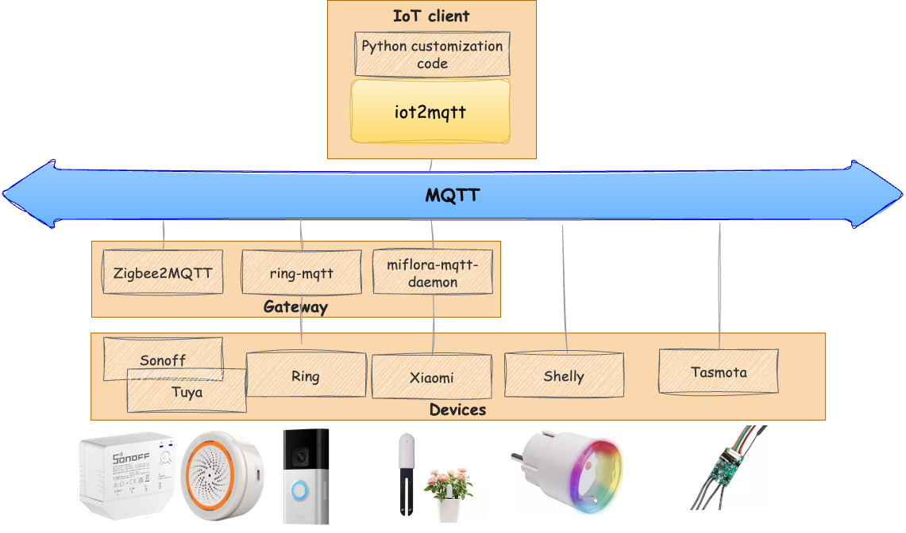

# iot2mqtt: Simplifying IoT Solutions with MQTT Integration

"Less is More - Powering Your IoT Solutions with MQTT integration"

## Introduction

**iot2mqtt** is a versatile Python library built upon the Paho™ MQTT client. It is designed to simplify IoT application development by providing a programmatic alternative to traditional home automation platforms, without the overpromises of no-code solutions.

## Description

**iot2mqtt** offers a robust and flexible solution for integrating various IoT devices using the MQTT protocol. Whether you are looking to connect directly with devices or through gateways, **iot2mqtt** provides the tools you need to build reliable and scalable IoT applications.

### Key Features

- **Programmatic Alternative**: Provides more flexibility and control compared to traditional home automation platforms like openHAB, Home Assistant, and Jeedom.
- **Reliable Communication**: Leverages the MQTT protocol to ensure reliable data transfer between devices.
- **Protocol-Agnostic**: Supports both direct device integration over MQTT (e.g., Shelly, Tasmota) and gateway integration (e.g., Zigbee2MQTT, ring to MQTT, miflora to MQTT).
- **Abstract Devices**: Comprehensive support for creating and managing abstract devices, simplifying the integration between different device models, providers, and protocols.

## Related projects

- [paho-mqtt](https://github.com/eclipse/paho.mqtt.python) : Eclipse Paho™ MQTT Python Client
- [miflora-mqtt-daemon](https://github.com/ThomDietrich/miflora-mqtt-daemon) : Xiaomi Mi Flora Plant Sensor MQTT Client/Daemon
- [ring-mqtt](https://github.com/tsightler/ring-mqtt) : Ring devices to MQTT Bridge
- [zigbee2mqtt](https://github.com/Koenkk/zigbee2mqtt) : Allows you to use your Zigbee devices without the vendor's bridge or gateway.
